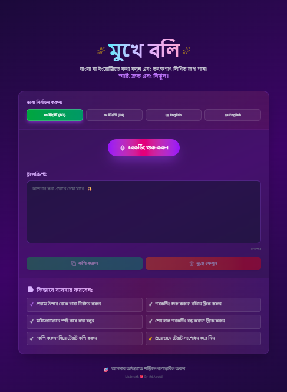

# 🎙️ মুখে বলি - Voice to Text Transcription App

> **বাংলা এবং ইংরেজিতে কথা বলুন এবং তৎক্ষণাৎ লিখিত রূপ পান - স্মার্ট, দ্রুত এবং নির্ভুল।**

<div align="center">


A modern, real-time speech recognition application that converts spoken words into text in multiple languages. Built with React, TypeScript, Vite, and powered by Web Speech API.

[Features](#-features) • [Getting Started](#-getting-started) • [Usage](#-how-to-use) • [Tech Stack](#-tech-stack) • [Project Structure](#-project-structure)

</div>

---

## 📸 UI Preview

<div align="center">
  

_Beautiful and intuitive user interface for seamless voice-to-text conversion_

</div>

---

## ✨ Features

-   🎤 **Real-time Speech Recognition** - Convert your voice to text instantly with continuous listening mode
-   🌐 **Multi-Language Support** - Seamlessly switch between Bengali (bn-BD) and English (en-US)
-   📋 **Easy Text Management** - Copy transcribed text with one click with visual feedback
-   🗑️ **Clear Functionality** - Reset and start fresh anytime with a single button
-   💫 **Beautiful UI** - Modern, responsive design with smooth animations and glassmorphism effects
-   ⚡ **Fast & Efficient** - Built with Vite for optimal performance and rapid development
-   📱 **Fully Responsive** - Works perfectly on desktop, tablet, and mobile devices
-   🎨 **Dark Theme** - Eye-friendly interface with gradient effects and animated blobs
-   📊 **Character Counter** - Keep track of your transcription length in real-time
-   ✏️ **Editable Transcript** - Edit recognized text directly in the textarea
-   🔔 **Live Recording Indicator** - Visual and animated feedback when recording is active

---

## 📦 Tech Stack

### Frontend Framework

-   **React** (v19.2.0) - UI library with hooks
-   **React DOM** (v19.2.0) - React rendering for web

### Speech Recognition

-   **react-speech-recognition** (v4.0.1) - React hooks wrapper for Web Speech API

### Styling & UI

-   **Tailwind CSS** (v4.1.17) - Utility-first CSS framework
-   **Tailwindcss Vite** (v4.1.17) - Vite plugin for Tailwind CSS
-   **Lucide React** (v0.553.0) - Beautiful, consistent icon library

## 📁 Project Structure

```
মুখে-বলি/
├── public/              # Static assets
├── src/
│   ├── components/      # React components
│   │   ├── BrowserSupportsSpeechRecognition.tsx  # Browser compatibility check
│   │   ├── Help.tsx                              # Help/FAQ component
│   │   └── languages.ts                          # Language configuration
│   ├── App.tsx          # Main application component with speech recognition logic
│   ├── App.css          # Component-specific styles
│   ├── main.tsx         # Application entry point
│   └── index.css        # Global styles and animations
├── index.html           # HTML entry point
├── package.json         # Project dependencies and scripts
├── vite.config.ts       # Vite configuration
├── tsconfig.json        # TypeScript base configuration
├── tsconfig.app.json    # TypeScript app configuration
├── tsconfig.node.json   # TypeScript node configuration
├── eslint.config.js     # ESLint configuration
└── README.md            # This file
```

---

## 🌍 Supported Languages

| Language | Code  | Status             |
| -------- | ----- | ------------------ |
| Bengali  | bn-BD | ✅ Fully Supported |
| English  | en-US | ✅ Fully Supported |

You can easily add more languages by updating the `src/components/languages.ts` file with new language codes and configurations.

---

## 🌐 Browser Compatibility

| Browser | Desktop | Mobile | Notes                        |
| ------- | ------- | ------ | ---------------------------- |
| Chrome  | ✅      | ✅     | Full support, recommended    |
| Edge    | ✅      | ✅     | Full support, Chromium-based |
| Safari  | ✅      | ✅     | Full support (v14.1+)        |
| Firefox | ⚠️      | ⚠️     | Limited support              |
| Opera   | ✅      | ✅     | Full support                 |

**Note:** Web Speech API requires HTTPS in production environments. The app includes a browser compatibility check component.

---

## 🎓 Learning Resources

-   [Web Speech API Documentation](https://developer.mozilla.org/en-US/docs/Web/API/Web_Speech_API)
-   [React Documentation](https://react.dev)
-   [React Hooks Guide](https://react.dev/reference/react/hooks)
-   [TypeScript Handbook](https://www.typescriptlang.org/docs/)
-   [Tailwind CSS Documentation](https://tailwindcss.com/docs)
-   [Vite Guide](https://vitejs.dev/guide/)

---

---

## 👨‍💻 Author

**Md Asraful**

-   💼 GitHub: [@asraful-devs](https://github.com/asraful-devs)

---

---

## 🎯 Future Enhancements

-   Voice settings (speed, pitch adjustment)
-   Real-time translations
-   Export to multiple formats
-   Cloud sync option (optional)
-   Mobile app version
-   Browser extension
-   API for third-party integrations

---

Thank you for checking out মুখে বলি! If you have any questions or suggestions, feel free to open an issue or contribute to the project. Happy coding! 🎉

---
